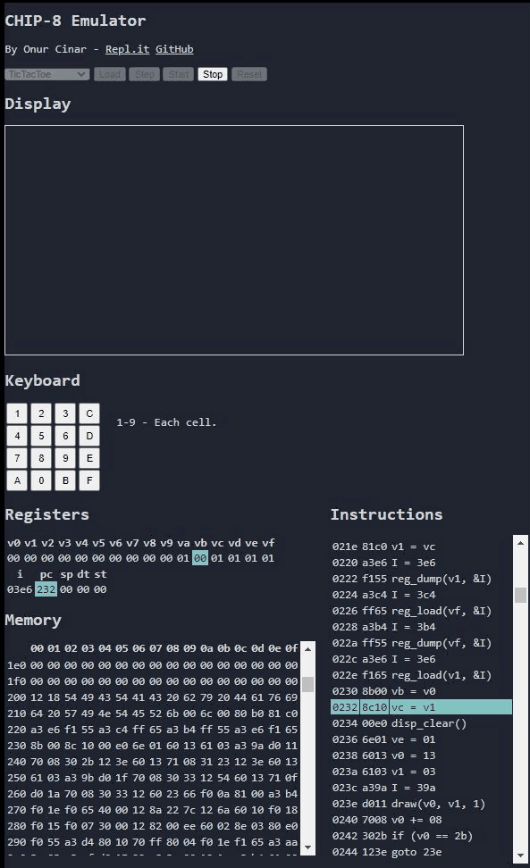

# CHIP-8 Emulator

This is a CHIP8 emulator that I developed in JavaScript. I was looking for a puzzle to keep my mind busy over the holidays. I was also looking for an opportunity to explore developing an application using an online IDE. I never built an emulator before, so this was my attempt to build one. I used [Repl.it](http://repl.it) as my online IDE.

I primarily used the [CHIP-8 Wikipedia](https://en.wikipedia.org/wiki/CHIP-8) page as a guide. The emulator has 4096KB of memory, 16 8-bit registers, 64x32 display, and 16 keys.

I was particularly  interested in seeing how the machine works at each step, so that I spent most of the time developing views to show the changes that are happening on the memory and the registers. There is also a view for the instructions to show the flow of the execution.

The entire code can run as a standalone web page. There are no dependencies to any other tools. 

## Demo

[Demo Page](https://cinar.github.io/Chip8EmulatorJS/).

## Usage

Choose a game and click the `Load` button. Once the game is loaded, you can either click the `Step` button to step through each individual insturction, or you can click the `Start` button to run the emulator. At any point in time, you can click the `Stop` button to stop the emulator. If you woud like to load a different game, simply click the `Reset` button.

## Resources

- [CHIP-8 Wikipedia](https://en.wikipedia.org/wiki/CHIP-8)
- [Cowgod's Chip-8 Technical Reference v1.0](http://devernay.free.fr/hacks/chip8/C8TECH10.HTM)

## Games

- [Chip-8 Program Pack](https://github.com/kripod/chip8-roms)

## License

The source code is provided under [MIT License](LICENSE).
